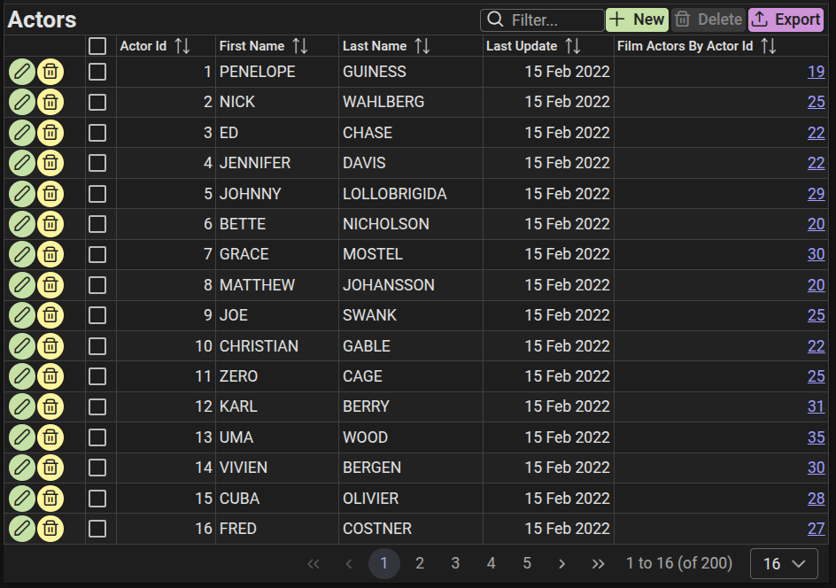
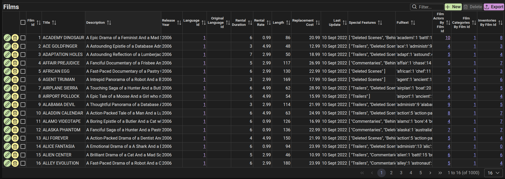
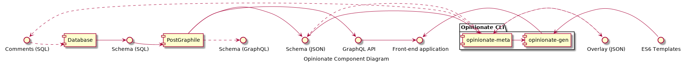

# Opinionate

An automated front-end (or full stack) application code generator/scaffolder, that converts a simple (codeless and declarative) definition into a fully functional application.

*Create a working application in minutes: just bring your own PostgreSQL database!*

Or rather, [PostGraphile](https://github.com/graphile/postgraphile) is used to automatically generate a GraphQL API/back-end (derived automatically from your existing database, using introspection). Then the front-end components are generated (similarly) from the GraphQL using ES6 template files, and any additional metadata you can provide (see below).

This version of Opinionate includes built-in templates that generate functional front-ends using the latest frameworks and technologies. The generated code is [TypeScript](https://www.typescriptlang.org) (and HTML templates) and is fully human-readable, enabling ongoing development and hand crafting. Alternatively, you can refine or customize the templates to better suit your needs, or you can create your own (which could target other technologies, such as React, see below).

The code is generated via an intermediate "metadata" stage (stored as an "overlay" file, which follows the structure of the database), and is somewhat self documenting, and can provide a particularly convenient and declarative way to manually fine-tune you application.

Of course, Opinionate can be used with other GraphQL server-side technologies, to automatically generate just the front-end/client.

Though there are some parallels, Opinionate is not based on AI and unlike "vibe coding", is fully reproducable and deterministic.

## Prerequisites

- install [Node.js](https://nodejs.org)
- install [PostgreSQL](https://www.postgresql.org)
- install your favoured package manager, e.g. [pnpm](https://pnpm.io) (alternatively, use npm, yarn, etc)
- install [TypeScript](https://www.typescriptlang.org) globally (you may need elevated privileges, e.g. prefix with sudo) `pnpm -g add typescript`
- install PostGraphile globally `pnpm -g add postgraphile`
- optionally, install a good IDE with TypeScript support, e.g. [VS Code](https://code.visualstudio.com)

## Example database installation

- create/configure the PostgreSQL database, e.g. [pagila](https://github.com/devrimgunduz/pagila), as follows:
- Download the sample database, then run psql to import and configure.
```bash
wget https://raw.githubusercontent.com/neondatabase/postgres-sample-dbs/main/pagila.sql
sudo -u postgres psql -d template1
```
- Enter the following SQL commands:
```sql
CREATE USER test WITH PASSWORD 'testpass';
CREATE DATABASE pagila;
\c pagila
\i pagila.sql
GRANT ALL PRIVILEGES ON ALL TABLES IN SCHEMA public TO test;
GRANT ALL PRIVILEGES ON ALL SEQUENCES IN SCHEMA public TO test;
\q
```
- Run PostGraphile (in the background) with: `postgraphile -c postgres://test:testpass@/pagila --cors --enhance-graphiql -n localhost -p 5000 -q /graphql &` (or later, with "backend")
- Optionally, you can click on the link to GraphiQL generated by the above, and explore the server by entering queries such as: `{allFilms {nodes {description releaseYear languageId length rating nodeId}}}`

## Pagila example [Vue](https://vuejs.org)/[PrimeVue](https://github.com/primefaces/primevue) front-end, using [Vite](https://github.com/vitejs/vite) and [Villus](https://github.com/logaretm/villus)

- create and change to your project directory: `mkdir primevue-pagila && cd primevue-pagila`
- you are strongly advised to initialize version control to help track source code changes (e.g. `git init`)
- copy the template's [package~.json](https://github.com/tjme/opinionate/blob/master/templates/primevue/package~.json) as your new package.json (remove backticks from beginning and end, and making adjustments, e.g. occurencies of the database name 'pagila' in the script, as appropriate)
- You may be able to improve the metadata generated, by editing the defaultMeta in your package.json, e.g. with a more tailored rule (to make most primary keys and last updated fields read-only), by changing the line beginning with "readonly" to: `"readonly": "${(isEntity(item) && item.fields[0].name!=='nodeId') || (!isEntity(item) && !isField(item)) || ['nodeId','lastUpdate'].includes(item.name) || (item.name.endsWith('Id') && item.name==parent.fields[1].name && !parent.fields[2].name.endsWith('Id'))}",`
- Likewise, identify specific currency fields by changing the line beginning with "format" by inserting (before `['money`): `['amount','rentalRate','replacementCost'].includes(item.name) ? 'currency' : ` (and likewise for maxDP, but replace '2' for 'currency')
- run the GraphQL server, with `pnpm backend &`
- generate everything: `pnpm gen`, OR do it stage by stage with:
  - create a data sources directory: `mkdir models`
  - install dependencies: `pnpm install`
  - generate JSON schema file: `pnpm gen-json` (alternatively, if not using PostGraphile, use apollo `pnpm gen-json-a` or get-graphql-schema `pnpm gen-json-g`)
  - optionally generate GraphQL schema file: `pnpm gen-gql` (alternatively, ditto the above)
  - create the TypeScript type definitions for the schema: `pnpm gen-ts`
  - create a configuration/overlay (for later enhancement and customization): `pnpm gen-overlay` (WARNING: this will overwrite any previous version/amendments)
  - to automatically (re)generate fully functional components/pages for each GraphQL node/entity, as well as common items: `pnpm gen-code` (WARNING: this will overwrite any previous versions/amendments)
- note that there is a problem with the rental_by_category materialized view not being populated, so remove it by removing all of the templates listed in overlayOut.json, just above the line `"label": "Rental By Category"`.
- note also, what seems to be a quirk of Postgraphile's pluralize function used on entity names results in an upper case instead of lower case "s" at the end of seven instances of names beginning with "PaymentP202220", but they can be easily accomodated by changes in overlayOut.json, e.g. changing `"plural": "PaymentP202201s",` to `"plural": "PaymentP202201S",`, etc
- it would be wise at this stage to use: `git add -A && git commit -m "opinionate gen"`
- run the development server, to deliver your new website: `pnpm dev`
- or build: `pnpm build` then run a production version: `pnpm preview`
- See [README~.md](templates/primevue/README~.md) for further details
- Go directly to the Actors page at [Actors](http://localhost:5173/#/Actor), and you should see something like: 
- Similarly, go to the Films page at [Films](http://localhost:5173/#/Film), and you should see something like: 

- For further examples, see [PrimeVue](doc/primevue-toh.md), [Vue & Vuetify](doc/vue-vuetify-toh.md) and [Angular](doc/angular-toh.md).

## Writing metadata

You can guide and improve the code generation performed by the template, by adding or amending metadata. For example (when using the built-in template), you can specify more user-friendly labels for individual tables and fields, and whether they should appear on List or CRUD pages.

The `opinionate meta` sub-command can be used in a number of ways to help manage the metadata. You can provide the metadata as a (JSON) overlay file, or in the PostgreSQL schema, as table and field comments. It can create starter (SQL and/or JSON) files, where you need only fill in the gaps (which is especially useful if you have a large schema).

You may want to amend some of the generated metadata, especially where fields are marked as "required". The "defaultMeta" rules automatically mark most "id" fields and the "last update" fields as read-only, so that (although marked as required) they cannot be entered manually, but are instead set automatically to defaults determined by the database. Other fields though (such as the rental duration and rate) also have defaults, but here, you may want to mark them as not "required" (so the database sets them if left blank), or alternatively you could set a corresponding default value for them in the overlay (to be applied by the front-end). Also, the "fulltext" field is not intended to be displayed or manually updated (but is expected by the database when a record is created), so "list" and "crud" should be removed from the "templates" array.

For more details on how to achieve this and more, see [Advanced Pagila](doc/primevue-pagila.md).

### Example usage of the opinionate meta command

You can generate an overlay file with default metadata using `opinionate meta --overlay-out models/overlayOut.json`, similarly you can generate a SQL script to create table and field comments containing metadata using `opinionate meta --comments-out models/comments.sql`. These assume there is a `models/schema.json` file describing the GraphQL schema (as produced by PostGraphile), otherwise you should use the `--schema` option to specify an alternative location.

You can define your own metadata structure (e.g. to extend the metadata available to the code generating templates), and this can include code to specify default values. This can simplify the templates, and has the added benefit of allowing some of those settings to be further customized (e.g. in the overlay file) before the final code is generated. Remember though, if you want to read the default metadata from an alternate location (rather than as config in your package.json file), add the metadata file parameter to both commands, e.g. `opinionate meta --default-meta models/customMeta.json` and `opinionate gen --default-meta models/customMeta.json`.

Note that you can use `opinionate meta -h` for more help.

## Writing your own Opinionate (ES6) template(s)

You can create your own Opinionate template folder tree, and pass it as a parameter, to generate exactly the code you want. Use the existing [templates](templates) as guides, along with the following tips.

Warning: if you have any existing ES6 template strings in your code, the quoting around (and any substitutions within) them must first be escaped, i.e. backticks: `` ` `` must become ``\` ``, and the beginnings of substituions, i.e. `${` must become `$\{`. Also any backslashes (e.g. for escaping) must be doubled-up.

Then add the substitutions required for the code generation.

For example, use `${entities}` for the array of entities/tables.

Similarly, in templates with filenames containing "\_ENTITIES\_", use `${entity.name}` for the entity/table name.
To generate a list of fields, use: ``// The fields of entity ${entity.name} are: ${entity.fields.filter(f => isField(f)).map(field => `${field.name}`).join("\n")}``.
You can place a guard function at the beginning of such a template, when metadata should determine existence, e.g: ``${!entity.meta.templates.includes("list") ? "" : ` `` (and add `` `} `` at the end).
Escape all embedded backquotes (especially the gql tagged strings) with backslash, e.g:

```js
const Fields = gql\`fragment theFields on ${entity.name} { nodeId,${entity.fields.map(field => `${field.name}`)} }\`;
```

## Motivation

Writing code can be difficult and time consuming, and is often highly repetitive. Code is regularly needed simply to translate from one data representation to another (e.g. SQL to JSON). It would be much easier to produce an application if it could simply be defined (declaratively) in one place, using a single language or notation (some refer to this as DRY: Don't Repeat Yourself).

Though modern frameworks such as Vue and Angular, and technologies such as GraphQL offer a lot of power and flexibility (and their CLIs provides some shortcuts) a lot of boilerplate code is still required to build a full stack application (so it's not very DRY). By making some assumptions (which are arguably opinionated), a lot of boilerplate code can be generated automatically. Even if some of the code is not quite appropriate or requires further development or hand-crafting, it might still save a lot of time. Hopefully also, it might be more efficient to refine the code generation/tool, rather than hand working the code afterwards.

## Structure



Any feedback will be gratefully received!

Thanks,
tim@merrison.co.uk
